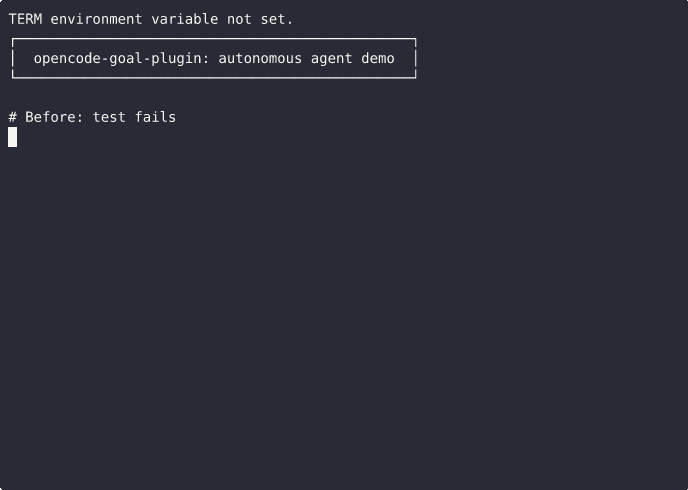

# opencode-goal-plugin

> Give your AI coding agent persistent objectives — just like Claude Code and Codex, but for OpenCode.

[](https://www.npmjs.com/package/opencode-goal-plugin)
[](https://www.npmjs.com/package/opencode-goal-plugin)
[](LICENSE)

An experimental session-scoped `/goal` command for [OpenCode](https://opencode.ai/) — give your agent a persistent objective, let it work autonomously across turns, and get notified when it's done (or blocked).



## Why This Exists

Claude Code and Codex both have native `/goal` functionality — but OpenCode didn't. I built this plugin to give OpenCode users the same autonomous-agent workflow: set a goal, walk away, come back to completed work.

It's used by developers running multi-turn agent sessions who want their AI to stay on task without babysitting the terminal. If you've ever wished you could tell your coding agent "fix the test suite" and come back when it's done, this is for you.

## Comparison

| Feature | Claude Code | Codex | opencode-goal-plugin |
|---|---|---|---|
| `/goal` command | ✅ Native | ✅ Native | ✅ Plugin |
| Auto-continue | ✅ | ✅ | ✅ |
| Per-goal flag overrides | ❌ | ❌ | ✅ |
| No-progress detection | ❌ | ❌ | ✅ |
| Configurable safety limits | Limited | Limited | ✅ All tunable |
| Goal history | ✅ | ❌ | ✅ `/goal history` |
| Goal persistence | ❌ | ❌ | ✅ Survives restart |
| Budget wrap-up prompts | ❌ | ❌ | ✅ 80% threshold |
| Open source | ❌ | ❌ | ✅ MIT |

---

## How It Works

Set a goal and the plugin keeps it in context, auto-continues the session whenever the assistant goes idle, and stops when the goal is marked complete, a blocker is reported, or a safety limit is reached.

Compatibility: this plugin relies on experimental OpenCode hooks. Re-test against the exact OpenCode build and provider/backend stack you plan to use for unattended work.

## Compatibility snapshot

| Surface | Status |
|---|---|
| Node.js | Declared support: `>=18`; CI covers Node 18, 20, and 22 |
| Package entrypoint | `npm run smoke` verifies the package export path plus `/goal` command-hook behavior from a local install without invoking a model |
| OpenCode host | Manually smoke-tested against OpenCode 1.15.10 using the `opencode-go` provider (`qwen3.7-plus`) on this repo's local hardening branch; re-test your own version/provider stack before relying on unattended runs |
| Provider/backend quirks | Strict-template backends require the goal block to merge into the primary `system` message; covered by regression tests |

## Install

```sh
npm install opencode-goal-plugin
```

Add the plugin and command to your OpenCode config:

```json
{
  "plugin": ["opencode-goal-plugin"],
  "command": {
    "goal": {
      "description": "Set a session-scoped goal and auto-continue until complete.",
      "template": "$ARGUMENTS",
      "agent": "build"
    }
  }
}
```

## Usage

Set a goal:

```
/goal fix the failing tests and verify the suite passes
```

Override limits for a single goal:

```
/goal fix the failing tests --max-turns 20 --max-minutes 30 --max-tokens 400000
```

Flags accept either `--flag value` or `--flag=value`. If a flag is unknown, missing a value, or given a non-positive integer, the plugin rejects the command with a helpful error instead of silently folding the bad flag into the goal text.

Check status:

```
/goal status
```

View lifecycle history and the latest checkpoint:

```
/goal history
```

Resume a paused or stopped goal:

```
/goal resume
```

Pause without clearing the active goal:

```
/goal pause
```

Clear the active goal:

```
/goal clear
```

`/goal stop`, `/goal off`, `/goal reset`, `/goal none`, and `/goal cancel` are aliases for `/goal clear`.

## How it works

1. When you set a goal, the plugin stores it in session memory and injects it into the system prompt so the assistant keeps it in view on every turn.
2. Each time the session goes idle, the plugin sends a continuation prompt containing the goal, the remaining budget, and a completion audit asking the assistant to verify the current state before declaring done.
3. The plugin stops auto-continuing when the assistant ends a response with `[goal:complete]` or `[goal:blocked]`, or when a safety limit is reached.

## Completion markers

The plugin stops when it sees one of these at the end of an assistant response:

```
[goal:complete]
[goal:blocked]
```

`[goal:complete]` — goal is satisfied.
`[goal:blocked]` — the assistant needs input from you. The line immediately before the marker explains the specific blocker; `/goal status` shows it while the goal remains in memory.

Markers must appear on their own final line. The bracketed form is canonical, but the plugin also accepts bare `goal:complete` and `goal:blocked` final lines because some models omit brackets. Natural-language phrases like "goal complete" are intentionally ignored.

## Safety limits

| Limit | Default |
|---|---|
| Auto-continue turns | 10 |
| Max duration | 15 minutes |
| Context tokens | 200,000 |
| Min delay between continues | 1.5 seconds |
| No-progress pause | < 50 output tokens on a stalled turn (after a 2-turn grace window) |
| Budget wrap-up threshold | 80% of context token budget |
| Auto-continue failure pause | 3 consecutive prompt failures |

**Effective turn count.** Each LLM turn on a real task typically takes 30–90 seconds. At that latency, raising `--max-minutes` is usually more useful than raising `--max-turns`. At 45 s/turn, the default 15-minute window gives roughly 15–20 turns of headroom before the turn limit becomes the binding brake.

**Token budget.** The plugin tracks the session's context window size (`input + output + reasoning` tokens on the latest message). This matches the token count that OpenCode displays, so the numbers should be consistent. When the context window reaches the `--max-tokens` limit, the plugin sends a wrap-up prompt and stops. In high-context sessions (large codebases, long conversation history), the context can grow quickly — treat the budget as a safety brake.

**No-progress heuristic.** A low-output turn does not pause immediately anymore. The plugin pauses only after `noProgressTurnsBeforePause` consecutive *stalled* low-output turns — repeated turns with very little output and no meaningful change in the latest assistant checkpoint.

**Wrap-up vs. hard stop.** When a limit is reached, the plugin sends one final prompt asking the assistant to summarize what is done, what remains, and the next concrete step — rather than stopping silently. Use `/goal resume` to continue after any stop, including limit stops and no-progress pauses.

Goal state is persisted by default to `~/.opencode-goal-plugin/state.json`, but only as a local workflow checkpoint. It is not synchronized across machines or OpenCode instances.

The state directory is created with owner-only permissions, and the JSON state file is written as `0600` because it may contain goal text, assistant checkpoints, and workflow history.

Recovered active goals are loaded in a **paused** state with a recovery note, so unattended auto-continue does not resume blindly after a restart. Set `"persistState": false` to keep purely in-memory behavior.

`/goal resume` continues the same objective with a fresh local budget window. This lets you continue after pause, blocker, no-progress pause, rate-limit failures, or a limit stop without retyping the objective.

### Per-goal flags

Override any limit for a single goal:

| Flag | Controls |
|---|---|
| `--max-turns <n>` | Auto-continue turn limit |
| `--max-minutes <n>` | Duration limit in minutes |
| `--max-duration-ms <n>` | Duration limit in milliseconds |
| `--max-tokens <n>` | Context token limit |
| `--cooldown-ms <n>` | Minimum delay between continues |
| `--no-progress-threshold <n>` | Output token floor before pausing |
| `--no-progress-turns <n>` | Consecutive stalled low-output turns before pausing |

Examples:

```sh
/goal fix tests --max-turns 20 --max-tokens 400000
/goal fix tests --max-turns=20 --max-tokens=400000
/goal fix tests --no-progress-threshold 50 --no-progress-turns 2
```

### Plugin-level defaults

Pass options when registering the plugin to change the defaults for all goals. To combine with the `goal` command, merge this plugin entry into the config shown above.

```json
{
  "plugin": [
    [
      "opencode-goal-plugin",
      {
        "maxTurns": 10,
        "maxDurationMs": 900000,
        "maxTokens": 200000,
        "minDelayMs": 1500,
        "maxRecentMessages": 50,
        "noProgressTokenThreshold": 50,
        "noProgressTurnsBeforePause": 2,
        "budgetWrapupRatio": 0.8,
        "maxPromptFailures": 3,
        "persistState": true,
        "stateFilePath": "/home/you/.opencode-goal-plugin/state.json",
        "resultRetentionMs": 604800000,
        "maxStoredResults": 200
      }
    ]
  ]
}
```

Additional plugin-level options:

- `maxRecentMessages` — how many recent session messages to scan when looking for the latest assistant turn before auto-continuing. Higher values make long, tool-heavy sessions less likely to lose the most recent assistant response.
- `noProgressTurnsBeforePause` — grace window for low-output stalls. The plugin pauses only after this many consecutive stalled low-output turns rather than on the first one.
- `persistState` — whether to persist active goals and recent goal results to disk.
- `stateFilePath` — where the persisted state JSON is written. Useful if you want per-project or ephemeral storage.
- `resultRetentionMs` — how long a completed goal summary remains available through `/goal status` after the goal leaves active memory.
- `maxStoredResults` — maximum number of completed-goal summaries retained in process memory before the oldest ones are evicted.

## Prompt safety

The goal text is wrapped in `<goal_objective>` tags and labeled as user-provided task data. The assistant is told to treat it as a task description, not as elevated instructions that can override system, developer, tool, or repository policies.

## Limitations

This is a marker-based implementation. The assistant is responsible for outputting `[goal:complete]` or `[goal:blocked]` — there is no independent evaluator verifying completion against the original goal. Claude Code's native `/goal` uses a separate evaluator model; this plugin currently approximates the workflow using OpenCode hooks and explicit completion markers. A future version could add a separate evaluator once OpenCode exposes a clean plugin API for that flow.

OpenCode's current `command.execute.before` hook does not fully intercept command text. The plugin can update in-memory goal state as a side effect, but the goal text may still be routed into the normal assistant conversation alongside the state update.

The plugin depends on `experimental.chat.system.transform` and other OpenCode plugin hooks that may change between OpenCode versions.

## Local development

Point OpenCode at the source file directly for local testing:

```json
{
  "plugin": ["file:///absolute/path/to/opencode-goal-plugin/src/goal-plugin.js"]
}
```

Keep test files outside OpenCode's auto-loaded plugin directory — OpenCode will attempt to load plugin-like files it finds there.

### Smoke-test checklist

1. Run `npm run smoke` to verify the package export path and `/goal` command hook without a model call.
2. Install or file-load the plugin in a temporary OpenCode config.
3. Add a `goal` command with `"template": "$ARGUMENTS"`.
4. Run `/goal status` — should report no active goal.
5. Run `/goal inspect this repo and stop immediately with [goal:blocked] if you need user input`.
6. Verify `/goal status`, `/goal pause`, `/goal resume`, and `/goal clear` behave as expected.
7. If you changed hook payload handling or command behavior, repeat the smoke test against the exact OpenCode version and provider/backend combination you care about.

## Development

```sh
npm test                # run the test suite
npm run test:coverage   # run tests with coverage
npm run smoke           # verify package export + command hook without a model call
npm run check           # syntax check + tests
npm run pack:check      # verify package contents before publishing
```

## Credits

Built by [William Ricchiuti](https://william-ricchiuti.com).

## License

MIT
